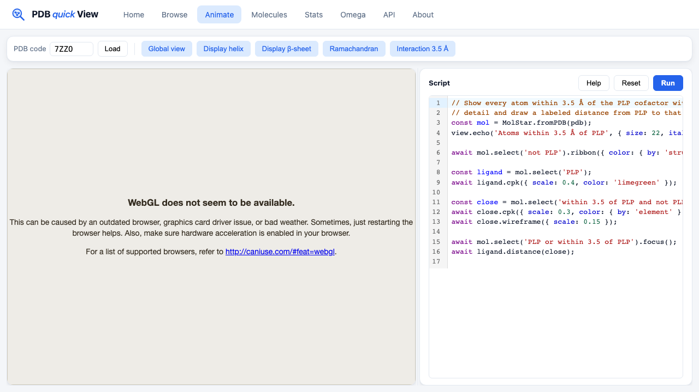

# pdb-quickview

A self-hosted, **fast** read-only mirror of the [worldwide Protein Data
Bank](https://www.wwpdb.org/). Every entry is parsed once into SQLite and
rendered once into PyMol thumbnails (100/200/400 px), so structure metadata
and previews are served straight from disk — no on-the-fly rendering, no
upstream lookup.



## What you get

- **Searchable index** — every PDB entry is parsed and indexed by number of
  residues, residue percentages, molecular weight, isoelectric point,
  ligand composition, etc. Free-text title search uses SQLite FTS5;
  ligand substructure search uses an OpenChemLib fingerprint screen
  followed by exact verification.
- **Precomputed thumbnails** — three sizes per entry, rendered once with
  PyMol so the homepage loads instantly.
- **Mirror of the raw files** — both asymmetric units and biological
  assemblies are kept on disk, kept up-to-date by a daily `rsync` against
  `rsync.wwpdb.org`. The raw `.gz` files are the single source of truth:
  the sqlite index can be wiped and rebuilt from them with `npm run
  rebuild`, no re-download required.
- **Small React dashboard** — homepage at `/` with database statistics
  and a thumbnail gallery, built from [`frontend/`](./frontend) into
  [`nginx/www/`](./nginx/www).

## Architecture

Three core containers, plus a CCD-refresh sidecar, wired together by
`docker compose`:

| Container       | Role                                                                                              |
| --------------- | ------------------------------------------------------------------------------------------------- |
| `nginx-proxy`   | Public read-only entry point (proxies `/v1/...` to `pdb-api`) + serves the homepage SPA           |
| `node-pdb-sync` | Daily cron: `rsync` the wwPDB tree, parse new files, render PyMol images, write to sqlite        |
| `pdb-api`       | Fastify server: parsed metadata, stats aggregates, raw file streaming, substructure search        |
| `pdb-api-cron`  | Weekly cron: refreshes `data/sqlite3/ligands.db` from the wwPDB Chemical Component Dictionary     |

All persistent state lives in `data/sqlite3/ligands.db` (parsed metadata,
ligand fingerprints, rsync history) plus the rsynced `.gz` archives.

## Deployment

Three example compose files are provided. Copy whichever matches your
deployment to `compose.yaml`, then start the stack.

```sh
cp .env.example .env
```

By default, every example pulls the released image
`ghcr.io/cheminfo/pdb-quickview:latest`. To build the image locally instead,
add `--build`:

```sh
docker compose pull && docker compose up -d        # released image
docker compose up -d --build                       # local build
```

### 1. Local / port-published — `compose.example.yaml`

Publishes nginx on `127.0.0.1:${NGINX_PORT}`. Open
`http://localhost:${NGINX_PORT}` once the database has finished its first
build.

```sh
cp compose.example.yaml compose.yaml
docker compose pull && docker compose up -d
```

### 2. Public via Cloudflare Tunnel — `compose.example.cloudflared.yaml`

No port published on the host; traffic enters via a `cloudflared` sidecar.

In the Cloudflare dashboard (https://dash.cloudflare.com):
**Networking → Tunnels → Create a tunnel → Cloudflared connector** → copy
the token into `.env` as `TUNNEL_TOKEN=...` → open the tunnel →
**Published applications** → add an application with **Service = HTTP**,
**URL = `nginx-proxy:80`**, **Public hostname = `pdb.lactame.com`** (or
your chosen hostname).

```sh
cp compose.example.cloudflared.yaml compose.yaml
docker compose pull && docker compose up -d
```

### 3. Public via Traefik — `compose.example.traefik.yaml`

Requires the host to already run a Traefik instance attached to an external
Docker network named `traefik`, with a `websecure` entrypoint and a
`letsencrypt` cert resolver. Adjust the `Host(...)` label to your hostname
(default `pdb.cheminfo.org`).

```sh
cp compose.example.traefik.yaml compose.yaml
docker compose pull && docker compose up -d
```

## HTTP API

All endpoints are read-only (`GET`/`HEAD`) and served by the Fastify
backend. Common ones:

| Path                                            | What it returns                                            |
| ----------------------------------------------- | ---------------------------------------------------------- |
| `/v1/database/info`                             | Entry counts and decompressed bytes per archive            |
| `/v1/pdbs/{id}`                                 | Parsed metadata for entry `{id}` (chains, helices, …)      |
| `/v1/pdbs/{id}/raw`                             | Raw `.pdb` text for entry `{id}` (gunzipped on the fly)    |
| `/v1/assemblies/{id}/raw`                       | Raw `.pdb1` text for the bio-assembly                      |
| `/v1/assemblies/{id}/image/{size}`              | Rendered PyMol thumbnail (`100x100`, `200x200`, `400x400`) |
| `/v1/pdbs?q=...&methods=...&yearMin=...`        | Search parsed metadata (FTS5 title + range filters)        |
| `/v1/stats/{view}`                              | Aggregated statistics (e.g. `byYear`, `aminoAcidFreq`, …)  |
| `/v1/ligands?substructure={idCode}`             | OpenChemLib substructure search over the CCD               |
| `/v1/rsync-history?type=asymUnit&limit=10`      | Recent rsync runs                                          |

## Persistent data

Everything writable lives under `./data/`:

```
data/
  pdb/                  # rsynced PDB asymmetric units (*.ent.gz)
  pdb-assembly/         # rsynced biological assemblies (*.pdb1.gz)
  pymol/<sub>/<id>/     # PyMol-rendered thumbnails (mirrors RCSB layout)
  sqlite3/              # ligands.db (parsed metadata, fingerprints, rsync history)
  ccd/                  # cached components.cif.gz from wwPDB
  logs/                 # rsync change logs
```

The first sync downloads the entire wwPDB tree and renders every thumbnail
— this can take **days**. Subsequent daily cycles only process the diff.

### Rebuild the database from local files

If the sqlite index ever needs to be regenerated (corruption, schema
upgrade, restoring from a partial backup), wipe `data/sqlite3/ligands.db`
and run:

```sh
docker compose exec node-pdb-sync npm run rebuild
```

This re-parses every `.ent.gz` and `.pdb1.gz` already on disk and rebuilds
all metadata tables. PyMol PNGs that already exist under
`data/pymol/<sub>/<id>/` are reused; missing ones are re-rendered. **No
data is re-downloaded from the wwPDB.**

The cron container also runs this automatically on boot whenever the
sqlite database is empty but the rsync directories already contain files
— so a fresh deploy that inherits a populated `data/` directory does the
right thing without any manual intervention.

## Local development

### Backend (`src/`)

```sh
npm install
npm run dev        # bring up the dev nginx-proxy + pdb-api containers
npm run dev:down   # stop the dev backend
```

`npm run dev` brings up two containers via
[`compose.dev.yaml`](./compose.dev.yaml):

- **pdb-api** — the Fastify backend, mounting `./data:/app/data`.
- **nginx-proxy** on `127.0.0.1:12346` — exposes the same HTTP API
  surface as production (`/v1/...`), so the Vite dev server below can
  talk to it transparently.

It then runs [`src/dev.js`](./src/dev.js) under `node --watch`: the
script applies migrations on `data/sqlite3/ligands.db` and ingests up to
`DEV_SEED_LIMIT` (default 20) `.ent.gz` files already present under
`data/pdb/`, so the API is queryable in seconds:

```sh
curl http://127.0.0.1:12346/v1/database/info
curl http://127.0.0.1:12346/v1/pdbs/100D
curl 'http://127.0.0.1:12346/v1/pdbs?methods=X-RAY+DIFFRACTION&limit=3'
```

Editing any file under `src/` re-runs the seed (idempotent — existing rows
are upserted). The full rsync pipeline and pymol-rendered biological
assemblies are skipped; if you need them locally you will need `pymol`,
`graphicsmagick`, and `rsync`, and should run `npm run cron` (or `npm run
rebuild` / `npm run update`) instead. Tests that depend on `pymol` are
skipped unless `HAS_PYMOL=1` is set.

```sh
npm run test       # tests + lint + format
npm run test-only  # vitest with coverage
```

### Frontend (`frontend/`)

```sh
cd frontend
npm install
npm run dev        # vite dev server, proxies /v1 to PDB_API_URL
                   #                   (default http://localhost:12346)
npm run build      # type-check + vite build → ../nginx/www
npm run test       # check-types + eslint + prettier
```

`npm run build` writes to `nginx/www/` (committed to git). After any change
under `frontend/src/`, rebuild and commit both the source change and the
updated assets so a `git pull && docker compose up -d` on the deploy host
picks up the new homepage without needing Node installed.

To point the Vite dev server at a **production stack** running on a
non-default port (`http://localhost:12346` is the dev-backend default):

```sh
PDB_API_URL=http://127.0.0.1:12345 npm run dev
```

Or at a remote stack:

```sh
PDB_API_URL=https://pdb.cheminfo.org npm run dev
```

## SELinux

If your host runs SELinux you may need to relabel the project directory so
the bind mounts are accessible from the containers:

```sh
chcon -R -t container_file_t <repo-dir>
```
